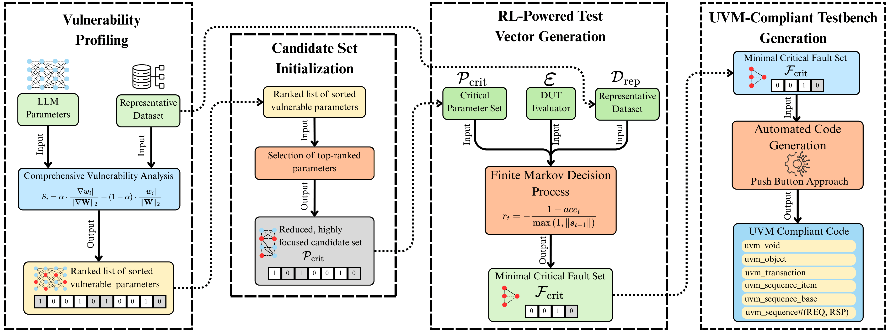

# RIFT: A Scalable Methodology for LLM Accelerator Fault Assessment using Reinforcement Learning


Official repository for **RIFT**, a reinforcement learning-driven framework designed to systematically identify critical hardware vulnerabilities in Large Language Model (LLM) accelerators.

**Authors:** Khurram Khalil, Muhammad Mahad Khaliq, Khaza Anuarul Hoque

**Affiliation:** Department of Electrical Engineering and Computer Science, University of Missouri–Columbia, USA

**Accepted Venue:** Design, Automation and Test in Europe Conference (DATE) 2026

---

## Abstract

The massive scale of modern AI accelerators presents critical challenges to traditional fault assessment methodologies, which face prohibitive computational costs and provide poor coverage of critical failure modes. This paper introduces RIFT (Reinforcement Learning-guided Intelligent Fault Targeting), a scalable framework that automates the discovery of minimal, high-impact fault scenarios for efficient design-time fault assessment. RIFT transforms the complex search for worst-case faults into a sequential decision-making problem, combining hybrid sensitivity analysis for search space pruning with reinforcement learning to intelligently generate minimal, high-impact test suites. Evaluated on billion-parameter Large Language Model (LLM) workloads using NVIDIA A100 GPUs, RIFT achieves a **2.2×** fault assessment speedup over evolutionary methods and reduces the required test vector volume by over **99%** compared to random fault injection, all while achieving **superior fault coverage**. The proposed framework also provides actionable data to enable intelligent hardware protection strategies, demonstrating that RIFT-guided selective error correction code provides a **12.8×** improvement in **cost-effectiveness** (coverage per unit area) compared to uniform triple modular redundancy protection. RIFT automatically generates UVM-compliant verification artifacts, ensuring its findings are directly actionable and integrable into commercial RTL verification workflows.

---

## Table of Contents

- [Methodology](#methodology)
- [Key Results](#key-results)
- [Repository Structure](#-repository-structure)
- [Citation](#citation)
- [License](#license)
- [Acknowledgments](#acknowledgments)
- [Contact](#contact)

---

## Methodology

RIFT operates across a highly optimized, four-phase architecture funnel designed to prune the massive search space and isolate critical vulnerabilities.

<p align="center">
  
</p>

### Phase 1: Vulnerability Profiling
Computes a **Hybrid Sensitivity Metric** that combines dynamic gradient importance and static parameter magnitude:

$$S_i = \alpha \cdot \frac{|\nabla w_i|}{\lVert \nabla W \rVert_2} + (1 - \alpha) \cdot \frac{|w_i|}{\lVert W \rVert_2}$$

This maps the hardware's most dangerous logical neighborhoods.

### Phase 2: Candidate Set Initialization
Applies a strict selection rate to isolate only a fraction of the top-ranked vulnerable parameters, dramatically pruning the intractable search space and localizing sensitive parameters to computationally critical hardware components.

### Phase 3: RL-Powered Fault Search
An RL agent models the attack as a Markov Decision Process (MDP). Guided by a custom reward function

$$r_t = -\frac{1 - acc_t}{\max(1, |s_{t+1}|)}$$

it systematically discards unproductive regions and learns to maximize accuracy degradation while strictly minimizing the number of injected bit-flips.

### Phase 4: Testbench Generation
Automatically translates the discovered minimal critical fault sets into synthesizable, UVM-compliant SystemVerilog code for immediate push-button integration into commercial EDA workflows.

---

## Key Results

Extensive evaluations on NVIDIA A100 GPUs using GPT-2 Large, LLaMA 3.1 8B, and DeepSeek-V2 7B against the MMLU benchmark demonstrate:

* **Efficiency & Speed:** Achieves a **7.5×** efficiency breakthrough compared to industry-standard Random Fault Injection (RFI), and is **2.2×** faster than state-of-the-art evolutionary methods (GenBFA).
* **Fault Coverage:** Reaches **91.7% coverage** in just **187 CPU hours**, accompanied by a **>99% reduction** in test vector volume.
* **Architectural Insights:** Complete functional collapse requires an average of only **5.4 ± 0.8 critical bits**. **88.5%** of these critical faults are highly concentrated in attention mechanisms and normalization layers.
* **Cost-Effective Protection:** Enables RIFT-guided targeted ECC, achieving 88.5% coverage with only a **13.8% area overhead** — delivering a **12.8× improvement in cost-effectiveness** compared to traditional uniform Triple Modular Redundancy (TMR).

---

## 📁 Repository Structure
*(Code release scheduled alongside the DATE 2026 camera-ready submission.)*

```text
rift-framework/
│
├── core/                           # Implementation of the 4-Phase RIFT Architecture
├── models/                         # Integration scripts for LLaMA, DeepSeek, GPT-2
├── experiments/                    # Run scripts for MMLU benchmark evaluations
├── assets/                         # Diagrams and visual assets
├── requirements.txt
└── README.md
```

---

## Citation

If you use RIFT in your research, please cite our DATE 2026 paper:

```bibtex
@inproceedings{khalil2026rift,
  author    = {Khalil, Khurram and Khaliq, Muhammad Mahad and Hoque, Khaza Anuarul},
  title     = {{RIFT}: A Scalable Methodology for {LLM} Accelerator Fault Assessment using Reinforcement Learning},
  booktitle = {Proceedings of the Design, Automation and Test in Europe Conference (DATE)},
  year      = {2026},
  address   = {TBD},
  publisher = {IEEE},
  note      = {To appear}
}
```

**Plain-text citation:**

> K. Khalil, M. M. Khaliq, and K. A. Hoque, "RIFT: A Scalable Methodology for LLM Accelerator Fault Assessment using Reinforcement Learning," in *Proceedings of the Design, Automation and Test in Europe Conference (DATE)*, 2026. To appear.

*This entry will be updated with page numbers, DOI, and proceedings metadata once the camera-ready version is published.*

---

## License

This project is released under the **MIT License**. See the [`LICENSE`](LICENSE) file for details.

---
